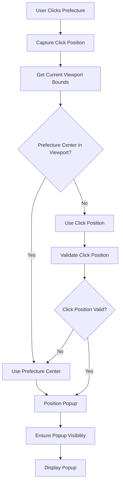

# Design Document: Smart Prefecture Popup Positioning

## Overview

This design implements intelligent positioning for prefecture popups in the Haachama Radar map application. The current implementation always positions popups at the prefecture center, causing poor UX when users are zoomed in and the center is not visible. The solution introduces viewport-aware positioning that uses the user's click location when the prefecture center is outside the current view.

The design leverages Leaflet's map API to detect viewport boundaries and implements a positioning strategy that prioritizes user context while maintaining popup accessibility and functionality.

## Architecture

### High-Level Flow



### Component Integration

The smart positioning logic integrates with existing components:

1. **mapPrefectureUtils.ts**: Enhanced to capture click positions and pass them to popup handlers
2. **PrefecturePopup.tsx**: Modified to accept and use dynamic positioning
3. **JapanMap.tsx**: Updated to handle position data flow between components

## Components and Interfaces

### Enhanced Prefecture Click Handler

```typescript
interface ClickPositionData {
  latlng: L.LatLng;
  originalEvent: MouseEvent;
  containerPoint: L.Point;
}

interface SmartPositionConfig {
  prefectureCenter: [number, number];
  clickPosition: [number, number];
  useClickPosition: boolean;
  viewportBounds: L.LatLngBounds;
}
```

### Updated Prefecture Utilities

The `createPrefectureHandlers` function will be enhanced to:

1. Capture click event coordinates
2. Calculate viewport boundaries
3. Determine optimal popup position
4. Pass positioning data to the popup component

```typescript
export const createPrefectureHandlers = (
  setSelectedPrefecture: (name: string, positionConfig: SmartPositionConfig) => void,
  isPopupOpening: React.RefObject<boolean>,
  chamaTrack?: FeatureCollection<Point, TrackProperties>
) => {
  return (feature: Feature<Geometry, PrefectureProperties>, layer: L.Layer) => {
    const prefectureName = feature.properties.nam;
    const prefectureCenter = feature.properties.center;

    layer.on({
      click: (e: L.LeafletMouseEvent) => {
        const map = e.target._map as L.Map;
        const clickPosition: [number, number] = [e.latlng.lat, e.latlng.lng];
        const viewportBounds = map.getBounds();
        
        // Determine if prefecture center is visible
        const centerInViewport = viewportBounds.contains(L.latLng(prefectureCenter));
        
        const positionConfig: SmartPositionConfig = {
          prefectureCenter,
          clickPosition,
          useClickPosition: !centerInViewport,
          viewportBounds
        };

        isPopupOpening.current = true;
        setSelectedPrefecture(prefectureName, positionConfig);
        
        setTimeout(() => {
          isPopupOpening.current = false;
        }, 500);
      },
      // ... existing mouseover/mouseout handlers
    });
  };
};
```

### Enhanced Prefecture Popup Component

```typescript
interface PrefecturePopupProps {
  selectedPrefecture: string;
  positionConfig: SmartPositionConfig;
  chamaTrack: FeatureCollection<Point, TrackProperties>;
  japanData: FeatureCollection<MultiPolygon, PrefectureProperties>;
  markerRefs: React.RefObject<Record<string, React.RefObject<TrackMarkerHandle | null>[]>>;
  popupRef: React.RefObject<L.Popup | null>;
  groupedMap?: Record<string, Feature<Point, TrackProperties>[]>;
}
```

### Viewport Boundary Calculator

```typescript
interface ViewportInfo {
  bounds: L.LatLngBounds;
  center: L.LatLng;
  zoom: number;
  pixelBounds: L.Bounds;
}

class ViewportCalculator {
  static getViewportInfo(map: L.Map): ViewportInfo {
    return {
      bounds: map.getBounds(),
      center: map.getCenter(),
      zoom: map.getZoom(),
      pixelBounds: map.getPixelBounds()
    };
  }

  static isPointInViewport(point: [number, number], bounds: L.LatLngBounds): boolean {
    return bounds.contains(L.latLng(point));
  }

  static adjustPositionForVisibility(
    position: [number, number], 
    bounds: L.LatLngBounds,
    popupSize: { width: number; height: number }
  ): [number, number] {
    // Implementation to ensure popup stays within viewport
    // considering popup dimensions and padding
    const padding = 20; // pixels
    // ... adjustment logic
    return position;
  }
}
```

## Data Models

### Position Configuration

```typescript
interface SmartPositionConfig {
  prefectureCenter: [number, number];
  clickPosition: [number, number];
  useClickPosition: boolean;
  viewportBounds: L.LatLngBounds;
  adjustedPosition?: [number, number];
}
```

### Click Event Data

```typescript
interface PrefectureClickEvent {
  prefectureName: string;
  clickCoordinates: [number, number];
  prefectureCenter: [number, number];
  timestamp: number;
  viewportBounds: L.LatLngBounds;
}
```

## Correctness Properties

*A property is a characteristic or behavior that should hold true across all valid executions of a system-essentially, a formal statement about what the system should do. Properties serve as the bridge between human-readable specifications and machine-verifiable correctness guarantees.*

### Property 1: Viewport Boundary Detection
*For any* map state (zoom level, center position), when a prefecture is clicked, the viewport boundary calculation should return valid bounds that contain the current map view
**Validates: Requirements 1.1**

### Property 2: Prefecture Center Containment Logic
*For any* prefecture center coordinates and viewport bounds, the containment check should correctly determine whether the center is within the viewport
**Validates: Requirements 1.2**

### Property 3: Smart Positioning Decision
*For any* prefecture click where the center is visible in the viewport, the popup should be positioned at the prefecture center; when the center is not visible, the popup should be positioned at the click location
**Validates: Requirements 1.3, 1.4, 3.1, 3.2**

### Property 4: Click Position Capture and Validation
*For any* prefecture click event, the system should capture the click coordinates and validate that they fall within the clicked prefecture boundaries
**Validates: Requirements 2.1, 2.2, 2.3**

### Property 5: Popup Visibility Constraint
*For any* popup position and viewport bounds, the positioned popup should be fully visible within the viewport boundaries with appropriate padding
**Validates: Requirements 1.5, 3.3, 4.1, 4.3**

### Property 6: Position Adjustment for Viewport Bounds
*For any* click position that would place a popup outside the viewport, the system should automatically adjust the position to keep the popup visible
**Validates: Requirements 3.4, 4.2**

### Property 7: Positioning Consistency Across Map States
*For any* zoom level and map size, the positioning logic should maintain consistent behavior in determining whether to use center or click position
**Validates: Requirements 3.5**

### Property 8: Control Collision Avoidance
*For any* popup position, the positioned popup should not overlap with existing map controls (GPS button, zoom controls)
**Validates: Requirements 4.4**

### Property 9: Viewport Calculation Caching
*For any* repeated viewport calculations with identical map states, the system should return cached results rather than recalculating
**Validates: Requirements 5.3**

### Property 10: Content Consistency Across Positioning Methods
*For any* prefecture popup, the content and functionality should remain identical regardless of whether it's positioned at the center or click location
**Validates: Requirements 6.2**

### Property 11: Popup Closing Behavior Consistency
*For any* positioned popup (center or click-positioned), the closing behavior should work identically
**Validates: Requirements 6.3**

### Property 12: Fallback Positioning on Errors
*For any* error in viewport calculation or click position capture, the system should fall back to prefecture center positioning while maintaining popup functionality
**Validates: Requirements 2.4, 8.1, 8.2, 8.3**

## Error Handling

### Viewport Calculation Failures
- **Fallback Strategy**: When `map.getBounds()` fails, use last known viewport bounds or default to full Japan view
- **Error Logging**: Log viewport calculation errors for debugging while maintaining functionality
- **Graceful Degradation**: Always fall back to prefecture center positioning when smart positioning fails

### Click Position Validation Failures
- **Boundary Validation**: Verify click positions fall within prefecture boundaries using Turf.js
- **Invalid Position Handling**: When click positions are outside prefecture boundaries, use prefecture center
- **Missing Click Data**: Handle cases where click event data is unavailable or corrupted

### Popup Positioning Edge Cases
- **Viewport Edge Collisions**: Adjust popup positions when they would extend beyond viewport boundaries
- **Control Overlap Prevention**: Detect and avoid positioning popups over existing map controls
- **Small Viewport Handling**: Prioritize popup visibility over exact positioning on very small screens

### Performance Safeguards
- **Calculation Timeouts**: Implement timeouts for viewport calculations to prevent UI blocking
- **Cache Invalidation**: Properly invalidate cached viewport data when map state changes
- **Memory Management**: Clean up positioning data when popups are closed or components unmount

## Testing Strategy

### Unit Testing Approach
- **Geometric Calculations**: Test viewport boundary detection and point containment logic
- **Position Validation**: Test click position validation against prefecture boundaries
- **Fallback Behavior**: Test error handling and fallback positioning scenarios
- **Cache Management**: Test viewport calculation caching and invalidation

### Property-Based Testing Configuration
The testing strategy uses **fast-check** for property-based testing with a minimum of 100 iterations per test. Each property test references its corresponding design document property and validates universal correctness across randomized inputs.

**Test Data Generation**:
- **Map States**: Generate random zoom levels (1-18), center coordinates, and viewport sizes
- **Prefecture Geometries**: Use actual prefecture boundary data for realistic testing
- **Click Positions**: Generate random coordinates within and outside prefecture boundaries
- **Viewport Bounds**: Create various viewport sizes and positions for comprehensive coverage

**Property Test Examples**:
```typescript
// Property 3: Smart Positioning Decision
fc.assert(
  fc.property(
    mapStateArbitrary,
    prefectureArbitrary,
    clickPositionArbitrary,
    (mapState, prefecture, clickPos) => {
      const centerInViewport = isPointInViewport(prefecture.center, mapState.bounds);
      const result = determinePopupPosition(prefecture, clickPos, mapState);
      
      if (centerInViewport) {
        expect(result.position).toEqual(prefecture.center);
      } else {
        expect(result.position).toEqual(clickPos);
      }
    }
  ),
  { numRuns: 100 }
);
```

**Integration Testing**:
- **Component Integration**: Test smart positioning with actual PrefecturePopup component
- **Map Interaction**: Test positioning behavior with real Leaflet map instances
- **User Workflow**: Test complete click-to-popup workflows with various map states
- **Cross-Browser Compatibility**: Verify positioning works across different browsers and devices

**Performance Testing**:
- **Calculation Speed**: Verify viewport calculations complete within performance thresholds
- **Memory Usage**: Monitor memory consumption during repeated positioning operations
- **Cache Effectiveness**: Measure cache hit rates and performance improvements

### Test Coverage Requirements
- **Core Logic**: 100% coverage of positioning decision logic and viewport calculations
- **Error Paths**: Complete coverage of all fallback and error handling scenarios
- **Edge Cases**: Comprehensive testing of boundary conditions and extreme map states
- **Integration Points**: Full coverage of component interfaces and data flow